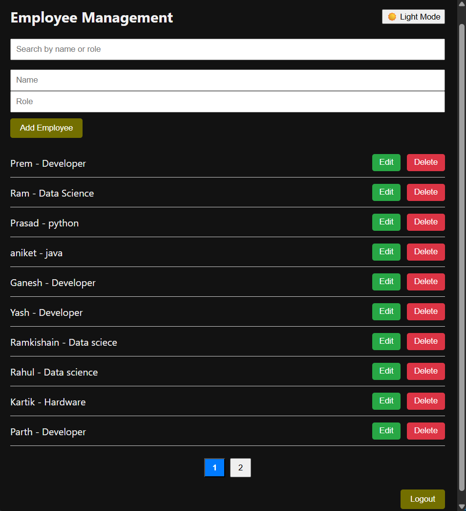
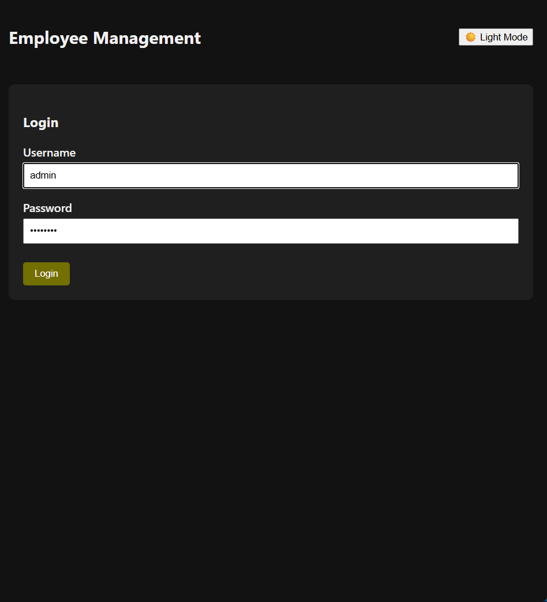

# 👨‍💼 Employee Management System

A full-stack Employee Management Web Application built with **React** (Frontend) and **Java Spring Boot** (Backend). It provides a secure admin panel to manage employee records, including adding, editing, deleting, and searching employees.




---

## 🚀 Features

- 🔐 **Login Authentication** (Admin Only)
- 🌗 **Dark/Light Mode Toggle**
- 📋 **Add / Edit / Delete Employees**
- 🔍 **Search by Name or Role**
- 📄 **Pagination for Employee List**
- 📱 **Responsive UI with clean styling**

---

## 🛠️ Tech Stack

### Frontend:
- React.js
- CSS (Custom Styling)
- Axios

### Backend:
- Java Spring Boot
- RESTful API
- Maven

---

## 📂 Folder Structure
employee-management/
├── employee-management-frontend/ # React Frontend
└── employee-management-backend/ # Spring Boot Backend


---

## ⚙️ Setup Instructions

### 🔧 Backend (Spring Boot)

```bash
cd employee-management-backend
# Open in your IDE (e.g., IntelliJ or Eclipse)
# Run the application (Spring Boot Main class)

# Frontend


cd employee-management-frontend
npm install
npm start


✨ Author
Developed by Sagar Dhondge
📧 sagardhondge56@gmail.com
---


